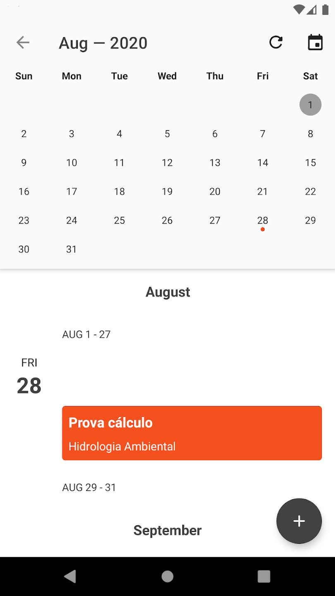

# Q Mobile - IFs do Brasil

O Q Mobile é o aplicativo não oficial do Q-Acadêmico, desenvolvido pelos alunos do Curso Técnico em Informática da turma de 2014 do IFSUL Campus Camaquã.

Veja suas notas, boletins, horários e calendário com um layout adaptado para dispositivos móveis.

O app aceita apenas login de alunos, não oferecendo suporte a login de professores e técnicos.

## Funciona para os campus

*IFAM 
*IFCE
*IFES
*IFF
*IFG
*IFGOIANO
*IFMA
*IFMT
*IFPE
*IFPI
*IFRR
*IFRS
*IFSUL

## Imagens

  
  
  
  

  
  
  
  

